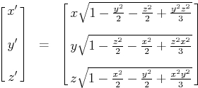
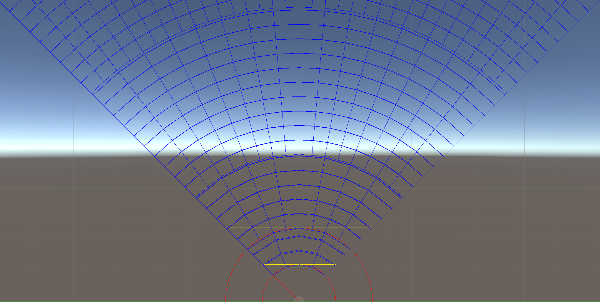
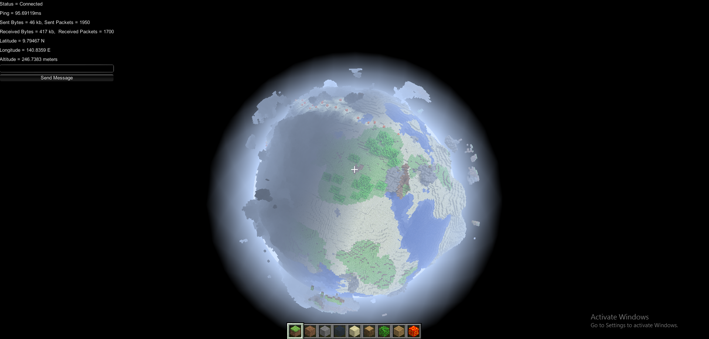
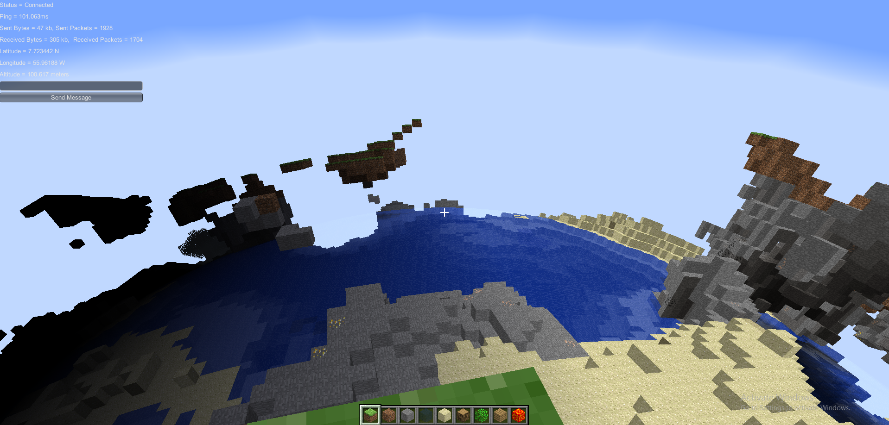
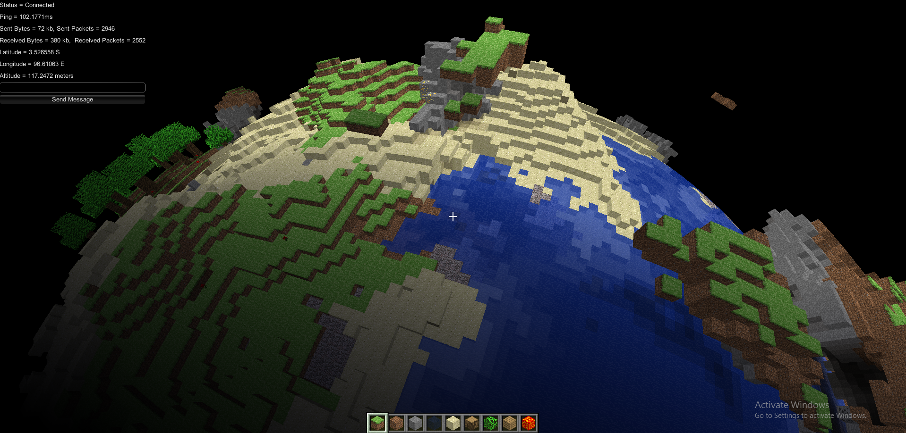

# Planetcraft

This is a playable proof-of-concept of a Minecraft-like voxel game mapped onto a large-scale spherical planet. It is written in C# and HLSL and created in Unity3D.

<video src="Movie_003.mp4" controls title="Title"></video>
This video demonstrates a 12km wide flatgrass planet with rings at `y=6025 x=2 z=2` using a mod that adds Minecraft content (examplemod.zip)

## Features
- A 12km wide spherical planet made of cubical voxels
- Basic JS modding API
- Flood-fill voxel lighting w/ ambient occlusion

## Why is this significant?

The planets in Planetcraft consist of **cubical voxels** on a **flat spherical surface**. It is [mathematically impossible to map any sort of plane (like a cube) to a sphere without distortion](https://en.wikipedia.org/wiki/Stereographic_projection#Cartography). Planetcraft does not try to fake anything using shaders, instead it explores several different techniques to try to minimize distortion while still being a true planet.

Rather than a single continous mapping, the world structure is arranged into 6 different grids, and mapped using [this equation](https://mathproofs.blogspot.com/2005/07/mapping-cube-to-sphere.html):

As you increase your altitude, blocks will start to stretch horizontally until they become ~2m wide, at which point the chunks will subdivide to try to minimize distortion. This project was designed with large-scale planets in mind which reduces the amount of subdivisions a player would encounter around sea level.

The final result is an uniquely shaped world structure. A 2D slice of which can be seen below:

## Media

Below are screenshots of an earlier version that supported planets only up to 200 meters wide. In this version, the core contained a highly distorted Nether layer.

